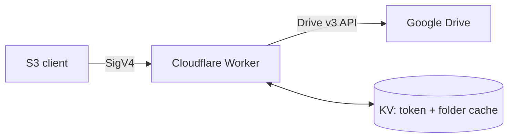
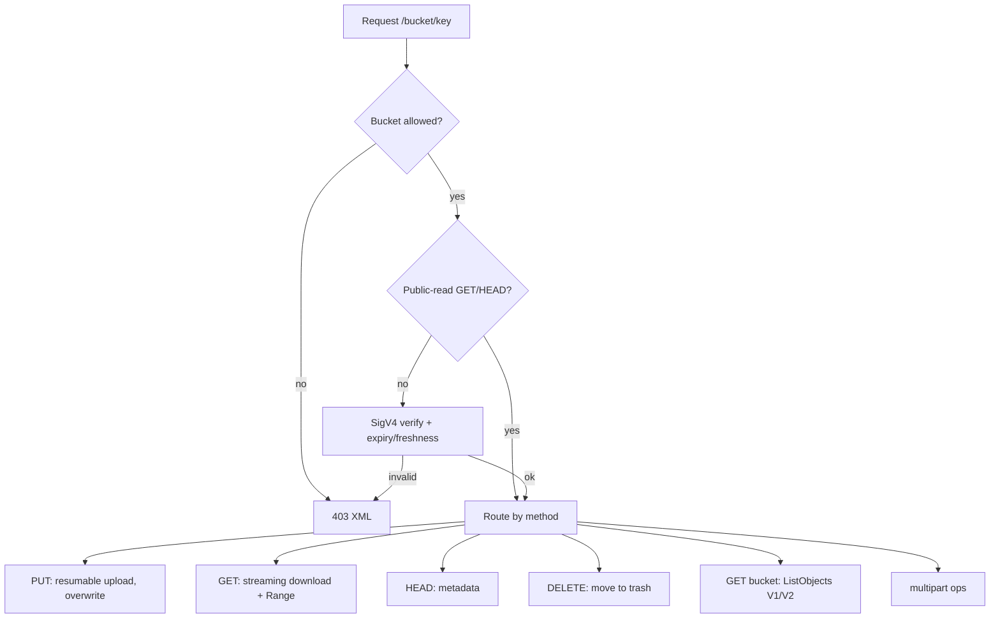
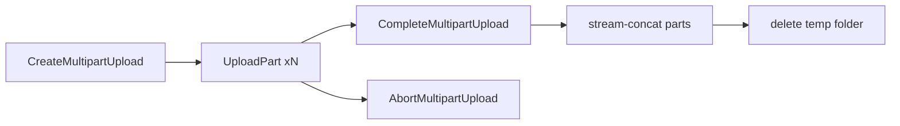

# gdrive-s3

S3-compatible endpoint for Google Drive, running on Cloudflare Workers. Works with rclone, aws cli, s3cmd, and AWS SDKs.

Built with [h3](https://h3.dev) and [Nitro](https://nitro.build) (`cloudflare_module` preset).

## Architecture



| S3 | Drive |
|---|---|
| Bucket | Root folder |
| Key `a/b/c` | Folders `a/b` + file `c` |
| Object | Drive file (ETag = file ID) |

## Request flow



## Multipart upload

The only path for objects > 100 MB (Workers body cap). Parts go to a temp folder `.gdrive-s3-multipart/<bucket>/<uploadId>`; on complete they are stream-concatenated into the final key.



## Setup

Secrets:

```sh
wrangler secret put ACCESS_KEY
wrangler secret put SECRET_KEY
wrangler secret put GOOGLE_CLIENT_ID
wrangler secret put GOOGLE_CLIENT_SECRET
wrangler secret put GOOGLE_REFRESH_TOKEN
```

Vars (`nitro.config.ts`): `REGION`, `ALLOWED_BUCKETS` (CSV or `*`), `PUBLIC_READ_BUCKETS`.
KV bindings (`nitro.config.ts`): `AUTH_KV`, `FOLDER_CACHE`.

Build: `npm run build` (Nitro, `cloudflare_module` preset).
Deploy: `npm run deploy`

## rclone config

```ini
[gdrive-s3]
type = s3
provider = Other
endpoint = https://<worker-domain>
access_key_id = <ACCESS_KEY>
secret_access_key = <SECRET_KEY>
region = auto
force_path_style = true
```

## Limits

- Single PUT ≤ 100 MB; larger objects require multipart (each part ≤ 100 MB).
- ETag is the Drive file ID, not MD5 — `rclone check` re-downloads.
- Drive rate limit 400 req/100 s; folder caching in KV mitigates it.
- DELETE moves files to trash (never permanent).

## Development

```sh
npm install
npm test        # vitest
npm run dev     # nitro build + wrangler dev (local KV bindings)
```
