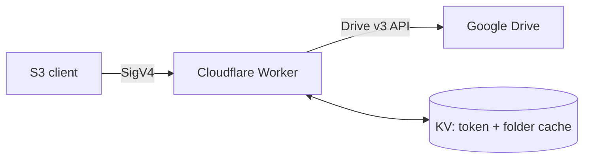
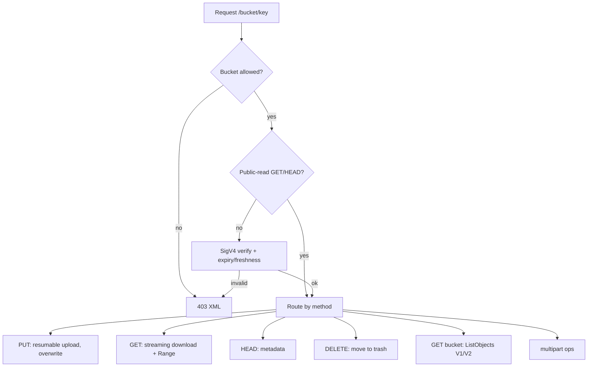
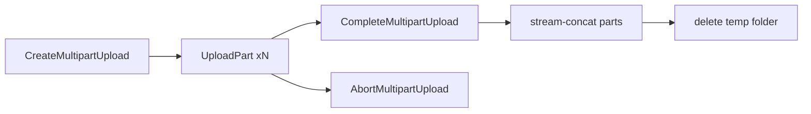

# gdrive-s3

S3-compatible endpoint for Google Drive, running on Cloudflare Workers. Works with rclone, aws cli, s3cmd, and AWS SDKs.

## Architecture



| S3 | Drive |
|---|---|
| Bucket | Root folder |
| Key `a/b/c` | Folders `a/b` + file `c` |
| Object | Drive file (ETag = file ID) |

## Request flow



## Multipart upload

The only path for objects > 100 MB (Workers body cap). Parts go to a temp folder `.gdrive-s3-multipart/<bucket>/<uploadId>`; on complete they are stream-concatenated into the final key.



## Setup

Secrets:

```sh
wrangler secret put ACCESS_KEY
wrangler secret put SECRET_KEY
wrangler secret put GOOGLE_CLIENT_ID
wrangler secret put GOOGLE_CLIENT_SECRET
wrangler secret put GOOGLE_REFRESH_TOKEN
```

Vars (`wrangler.jsonc`): `REGION`, `ALLOWED_BUCKETS` (CSV or `*`), `PUBLIC_READ_BUCKETS`.
KV bindings: `AUTH_KV`, `FOLDER_CACHE`.

Deploy: `wrangler deploy`

## rclone config

```ini
[gdrive-s3]
type = s3
provider = Other
endpoint = https://<worker-domain>
access_key_id = <ACCESS_KEY>
secret_access_key = <SECRET_KEY>
region = auto
force_path_style = true
```

## Limits

- Single PUT ≤ 100 MB; larger objects require multipart (each part ≤ 100 MB).
- ETag is the Drive file ID, not MD5 — `rclone check` re-downloads.
- Drive rate limit 400 req/100 s; folder caching in KV mitigates it.
- DELETE moves files to trash (never permanent).

## Union mode (multiple service accounts)

Set `UNION_MODE=union` and provide service-account credentials to merge several
Drives into one logical namespace (rclone-union semantics). Each service account
is one upstream; a bucket lives as a root folder in each SA's Drive.

Config vars (all optional except the credentials):

| Var | Default | Meaning |
|---|---|---|
| `UNION_MODE` | `round-robin` | `union` enables the feature (SA-only) |
| `UNION_SEARCH_POLICY` | `ff` | search category (`ff epff epmfs eplus eprand newest epall`) |
| `UNION_ACTION_POLICY` | `epall` | modify category (`epall epff epmfs eplus eprand`) |
| `UNION_CREATE_POLICY` | `epmfs` | write-new category (`epmfs epall eprand ff eplus eplfs`) |
| `UNION_CACHE_TIME` | `120` | quota + search-memo KV TTL (s) |
| `UNION_MIN_FREE_SPACE` | `1073741824` | lfs/eplfs free-space filter (bytes) |
| `UNION_MAX_UPSTREAMS` | `16` | hard cap on SA fan-out |

Upstream flags ride in each SA's JSON entry: `writable: false` (read-only, `:ro`)
inhibits writes and deletes; `creatable: false` (`:nc`) excludes the SA from new
object/bucket creation. `GOOGLE_REFRESH_TOKEN` must be empty.

**Shared drives are required for uploads.** Google rejects file creation from a
service account in its own My Drive with `403 Service Accounts do not have
storage quota`. To actually store objects, put the SAs into a shared drive and
set `SHARED_DRIVE_ID=<drive id>` — every SA root then resolves to the shared
drive root, and all Drive calls use `supportsAllDrives`/team-drive semantics.
(Consumer Gmail accounts cannot create shared drives; this needs Workspace.)
Without a shared drive, folder/bucket operations work but object PUT/multipart
uploads fail with 403.

Storage payloads larger than the 5 KB secret limit go in `AUTH_KV` under key
`service_accounts` (JSON array or rclone concatenated-blob format).

### Union semantics

- `ff` search is deterministic (lowest-index upstream wins) because S3 clients
  re-request the same key and must see the same object; the winner is memoized
  in KV (`path:<bucket>:<key>`).
- `epall` create mirrors each upload into every upstream (N× quota/bandwidth —
  the point when per-SA quota is the constraint). Overwrites refresh every
  ACTION target; deletes trash every ACTION copy.
- Missing quota info is treated as unlimited; ties resolve to the lowest index.
- Listing is a bounded-parallel k-way merge of every upstream's Drive walk;
  duplicate keys emit one entry (the search winner's metadata). Continuation
  tokens carry per-upstream grid state.
- Multipart parts are stored in the primary upstream's temp folder; complete
  stream-concatenates them into each CREATE target.

## Development

```sh
npm install
npm test        # vitest
npx wrangler dev
```
